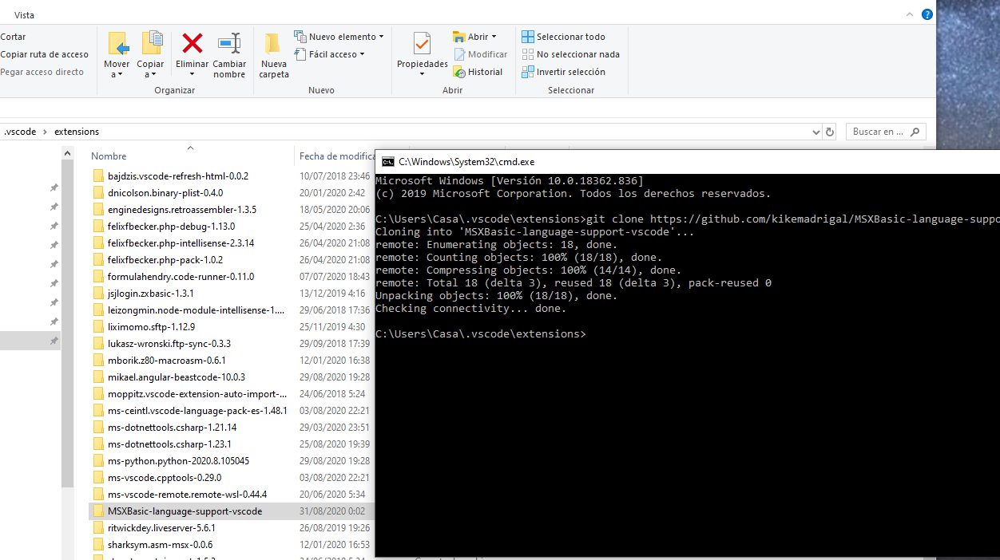
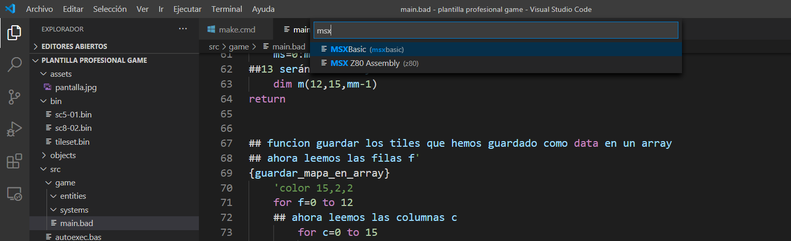

# MSXBasic for vscode

Es una extesión o complemento para que las palabras reservadas de MSX Basic aparezcan con colorines.

## Instalación / setup

Pega este repositorio en la dirección C:\Users\tu_usuario\\.vscode\extensions

Paste this repository in the path 
C:\Users\you_user\\.vscode\extensions

Abre tu archivo .bas, .bad, .asc y elige el lenguage MSXBasic:

Open your .bas, .bas, .asc file and choose the MSXBasic language:

Para añadir nuevas palabras o una sintaxis distinta cambia el archivo:

To add new words or a different syntax change the file:

https://github.com/kikemadrigal/MSXBasic-language-support-vscode/blob/master/syntaxes/MSXBasic.tmLanguage.json
